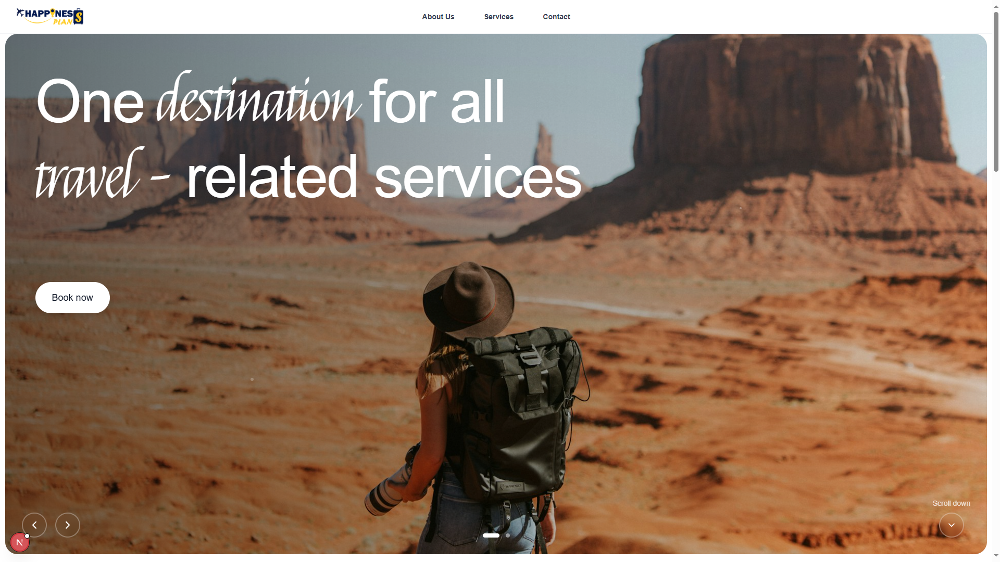

# Happiness Plans Website

A modern, responsive website for Happiness Plans - a comprehensive travel services company built with Next.js and TypeScript.

## Features

- **Modern Design**: Clean, professional design with brand colors (Navy Blue #00154B, Golden Yellow #F3D11C)
- **Responsive**: Mobile-first responsive design that works on all devices
- **Fast Performance**: Built with Next.js for optimal loading times and SEO
- **TypeScript**: Full TypeScript implementation for type safety
- **Contact Forms**: contact forms with validation
- **SEO Optimized**: Proper meta tags and semantic HTML structure

## Technology Stack

- **Framework**: Next.js 14 with App Router
- **Language**: TypeScript
- **Styling**: Tailwind CSS
- **Fonts**: Google Fonts (Inter, Montserrat, Dancing Script)
- **Images**: Unsplash API for high-quality destination photos

## 🎨 Design Features

- **Brand Colors**: Navy Blue primary, Golden Yellow secondary
- **Typography**: Montserrat for headings, Inter for body text, Dancing Script for accents
- **Interactive Elements**: Hover animations, smooth transitions
- **Image Carousel**: Auto-rotating hero background images
- **Customer Testimonials**: Rotating testimonial carousel
- **Form Validation**: Client-side form validation with TypeScript

## Pages

- **Homepage**: Hero section, services grid, trust indicators, quick booking
- **About Us**: Company story, values, why choose us
- **Services**: Detailed service offerings and descriptions
- **Contact**: Contact information, form, and global presence map
